我们仍以常用的方式建立数据库连接，如下代码所示:

```java
@Before
public void init() throws ClassNotFoundException, SQLException {
    Class.forName("com.mysql.jdbc.Driver");
    connection = DriverManager.getConnection(
        "jdbc:mysql://localhost:3306/test", "tiger", "tiger");
}
```

# 驱动注册

当mysql驱动类被加载时，会向java.sql.DriverManager进行注册，Driver静态初始化源码:

```java
static {
    java.sql.DriverManager.registerDriver(new Driver());
}
```

DriverManager.registerDriver:

```java
public static synchronized void registerDriver(java.sql.Driver driver,
    DriverAction da) {
    /* Register the driver if it has not already been added to our list */
    if(driver != null) {
        registeredDrivers.addIfAbsent(new DriverInfo(driver, da));
    }
}
```

registeredDrivers其实是一个CopyOnWriteArrayList类型，DriverAction用于当驱动被取消注册时被调用，DriverInfo是DriverManager的内部类，其实就是对Driver和DriverAction对象进行了一次包装，并没有其它的作用。

接下来看一下驱动接口Driver的定义，位于java.sql包下，类图:

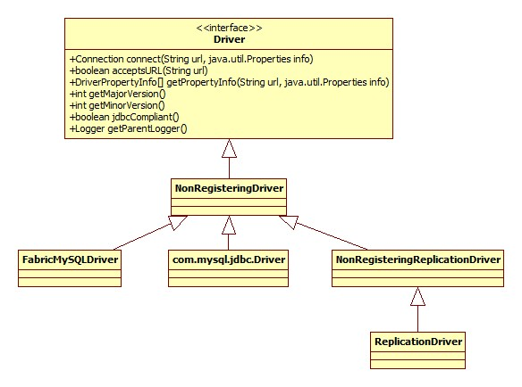

DriverManager.getConnection方法调用了NonRegisteringDriver的connect方法:

```java
public java.sql.Connection connect(String url, Properties info) {
    if (url != null) {
        if (StringUtils.startsWithIgnoreCase(url, LOADBALANCE_URL_PREFIX)) {
            return connectLoadBalanced(url, info);
        } else if (StringUtils.startsWithIgnoreCase(url, REPLICATION_URL_PREFIX)) {
            return connectReplicationConnection(url, info);
        }
    }
    Properties props = null;
    if ((props = parseURL(url, info)) == null) {
        return null;
    }
    if (!"1".equals(props.getProperty(NUM_HOSTS_PROPERTY_KEY))) {
        return connectFailover(url, info);
    }
    Connection newConn = com.mysql.jdbc.ConnectionImpl.
        getInstance(host(props), port(props), props, database(props), url);
    return newConn;
}
```

从源码中可以看出，系统针对URL的不同采用了不同的连接策略，对于以jdbc:mysql:loadbalance://开头的URL，便以Master/Slave的架构进行连接，对于以jdbc:mysql:replication://开头的URL便按照双主的架构进行连接，如果就是我们使用的普通的URL，那么检测URL中节点的数量，如果大于1，那么使用failOver的方式，最后才是我们的测试代码中单节点的连接方式。

关于以上提到的Mysql两种集群模式，可以参考:

[Mysql之主从架构的复制原理及主从/双主配置详解(二)](http://blog.csdn.net/sz_bdqn/article/details/46277831)

parseURL方法用于解析URL中的各个属性，下面是对于默认URL解析之后得到的结果截图:

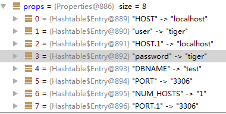

ConnectionImpl.getInstance方法对当前jdbc版本进行了区分:

```java
protected static Connection getInstance(String hostToConnectTo, int portToConnectTo,
    Properties info, String databaseToConnectTo, String url){
    if (!Util.isJdbc4()) {
        return new ConnectionImpl(hostToConnectTo, portToConnectTo, info, databaseToConnectTo, url);
    }
    return (Connection) Util.handleNewInstance(JDBC_4_CONNECTION_CTOR,
        new Object[] { hostToConnectTo, Integer.valueOf(portToConnectTo),
        info, databaseToConnectTo, url }, null);
}
```

驱动通过判断当前classpath下是否存在java.sql.NClob来决定是否是jdbc4版本，子jdk6开始自带的便是jdbc4版本，各个版本之间的区别在于高版本提供更多的接口实现，接下来都以jdbc4版本进行说明。

handleNewInstance方法所做的其实就是利用反射的方法构造了一个com.mysql.jdbc.JDBC4Connection的对象，后面的Object数组便是构造器的参数。

这里就涉及到了jdbc里的另一个核心接口: Connection:

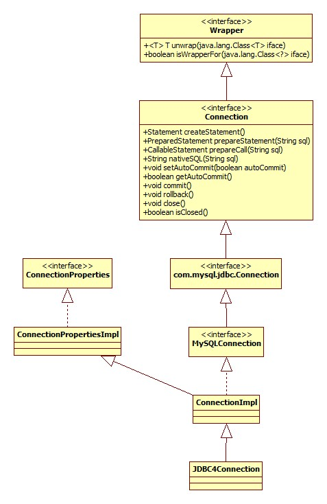

核心连接逻辑位于ConnectionImpl的构造器中，其核心逻辑(简略版源码)如下:

```java
public ConnectionImpl(...) {
    initializeDriverProperties(info);
    initializeSafeStatementInterceptors();
    createNewIO(false);
    unSafeStatementInterceptors();
}
```

下面分部分对其进行说明。

# 属性解析

info是一个Properties对象，由jdbc连接url解析而来，Mysql的url允许我们进行参数的传递，对于我们普通的没有参数的url: jdbc:mysql://localhost:3306/test，解析得到的属性对象如下图:


从上面类图中可以看出，ConnectionImpl其实是ConnectionPropertiesImpl的子类，而**ConnectionPropertiesImpl正是连接参数的载体**，所以initializeDriverProperties方法的目的可以总结如下:

- 将我们通过URL传入的参数设置到ConnectionPropertiesImpl的相应Field中去，以待后续进行连接时使用。
- 根据我们传入的以及默认的参数对相应的数据结构进行初始化。

initializeDriverProperties首先调用了父类的initializeProperties方法，用以实现第一个目的，简略版源码:

```java
protected void initializeProperties(Properties info) throws SQLException {
    if (info != null) {
        Properties infoCopy = (Properties) info.clone();
        int numPropertiesToSet = PROPERTY_LIST.size();
         for (int i = 0; i < numPropertiesToSet; i++) {
            java.lang.reflect.Field propertyField = PROPERTY_LIST.get(i);
            ConnectionProperty propToSet = (ConnectionProperty) propertyField.get(this);
            propToSet.initializeFrom(infoCopy, getExceptionInterceptor());
         }
    }
}
```

ConnectionPropertiesImpl中的配置字段其实都是ConnectionProperty(定义在其内部)类型:

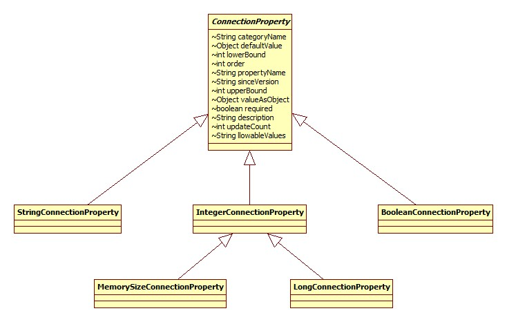

下面是这种属性的典型定义方式:

```java
private IntegerConnectionProperty loadBalanceAutoCommitStatementThreshold = new IntegerConnectionProperty
    ("loadBalanceAutoCommitStatementThreshold", 0, 0,
    Integer.MAX_VALUE, Messages.getString("ConnectionProperties.loadBalanceAutoCommitStatementThreshold"),
     "5.1.15", MISC_CATEGORY, Integer.MIN_VALUE);
```

PROPERTY_LIST其实就是用反射的方法得到的ConnectionPropertiesImpl中所有ConnectionProperty类型Field集合，定义以及初始化源码如下:

```java
private static final ArrayList<Field> PROPERTY_LIST = new ArrayList<>();
static {
    java.lang.reflect.Field[] declaredFields = ConnectionPropertiesImpl.class.getDeclaredFields();
    for (int i = 0; i < declaredFields.length; i++) {
        if (ConnectionPropertiesImpl.ConnectionProperty.class.isAssignableFrom(declaredFields[i].getType())) {
            PROPERTY_LIST.add(declaredFields[i]);
        }
    }
}
```

initializeFromfan方法所做的正如其方法名，就是从属性对象中检测有没有和自己相匹配的设置项，如果有，那么更新为我们设置的值，否则使用默认值。

ConnectionProperty.initializeFrom:

```java
void initializeFrom(Properties extractFrom, ExceptionInterceptor exceptionInterceptor) {
    String extractedValue = extractFrom.getProperty(getPropertyName());
    extractFrom.remove(getPropertyName());
    initializeFrom(extractedValue, exceptionInterceptor);
}
```

以StringConnectionProperty为例，接收(String, ExceptionInterceptor)参数的initializeFrom方法实现如下:

```java
@Override
void initializeFrom(String extractedValue, ExceptionInterceptor exceptionInterceptor) {
    if (extractedValue != null) {
        validateStringValues(extractedValue, exceptionInterceptor);
        this.valueAsObject = extractedValue;
    } else {
        //使用默认值
        this.valueAsObject = this.defaultValue;
    }
    this.updateCount++;
}
```

从上面类图中可以看到，ConnectionProperty中有一个allowableValues字段，对于StringConnectionProperty来说validateStringValues的逻辑很简单，就是依次遍历整个allowableValues数组，检查给定的设置值是否在允许的范围内，核心源码如下:

```java
for (int i = 0; i < validateAgainst.length; i++) {
    if ((validateAgainst[i] != null) && validateAgainst[i].equalsIgnoreCase(valueToValidate)) {
        //检查通过
        return;
    }
}
```

# 异常拦截器

initializeDriverProperties方法相关源码:

```java
String exceptionInterceptorClasses = getExceptionInterceptors();
if (exceptionInterceptorClasses != null && !"".equals(exceptionInterceptorClasses)) {
    this.exceptionInterceptor = new ExceptionInterceptorChain(exceptionInterceptorClasses);
}
```

很容易想到，getExceptionInterceptors方法获取的其实是父类中定义的exceptionInterceptors属性:

```java
private StringConnectionProperty exceptionInterceptors = new StringConnectionProperty("exceptionInterceptors", null,
    Messages.getString("ConnectionProperties.exceptionInterceptors"), "5.1.8", MISC_CATEGORY, Integer.MIN_VALUE);
```

也就是说我们可以通过给URL传入exceptionInterceptors参数以定义我们自己的异常处理器，并且是从Mysql 5.1.8版本才开始支持，这其实为我们留下了一个扩展点: 可以不修改业务代码从而对Mysql驱动的运行状态进行监控。只找到了下面一篇简单的介绍文章:

[Connector/J extension points – exception interceptors](http://mysqlblog.fivefarmers.com/2011/11/21/connectorj-extension-points-%E2%80%93-exception-interceptors/)

所有的异常拦截器必须实现ExceptionInterceptor接口，这里要吐槽一下，这个接口竟然一行注释也没有！

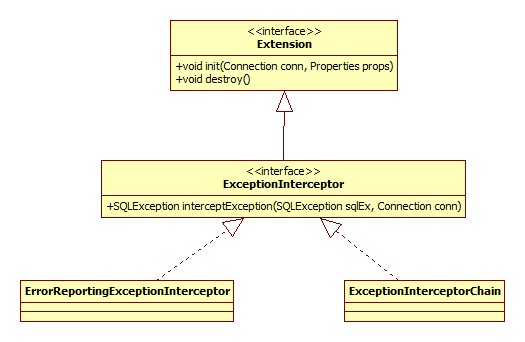

ExceptionInterceptorChain其实是装饰模式的体现，内部有一个拦截器列表:

```java
List<Extension> interceptors;
```

其interceptException方法便是遍历此列表依次调用所有拦截器的interceptException方法。

## 初始化

由ExceptionInterceptorChain的构造器调用Util.loadExtensions方法完成:

```java
public static List<Extension> loadExtensions(Connection conn, Properties props, String extensionClassNames, String errorMessageKey,
            ExceptionInterceptor exceptionInterceptor) {
    List<Extension> extensionList = new LinkedList<Extension>();
    List<String> interceptorsToCreate = StringUtils.split(extensionClassNames, ",", true);
    String className = null;
    for (int i = 0, s = interceptorsToCreate.size(); i < s; i++) {
        className = interceptorsToCreate.get(i);
        Extension extensionInstance = (Extension) Class.forName(className).newInstance();
        extensionInstance.init(conn, props);
        extensionList.add(extensionInstance);
    }
    return extensionList;
}
```

从这里可以看出以下几点:

- exceptionInterceptors参数可以同时指定多个拦截器，之间以逗号分隔。
- 拦截器指定时必须用完整的类名。
- 按照我们传入的参数的顺序进行调用。

# 国际化

从上面配置项的定义可以看出，Mysql使用了Messages类对消息进行了处理，这里Messages其实是对jdk国际化支持ResourceBundle的一层包装，下面是其简略版源码:

```java
public class Messages {
    private static final String BUNDLE_NAME = "com.mysql.jdbc.LocalizedErrorMessages";
    private static final ResourceBundle RESOURCE_BUNDLE;
    public static String getString(String key) {
        return RESOURCE_BUNDLE.getString(key);
    }
}
```

这里省略了资源加载的过程，什么是国际化，问度娘就好了。

# 日志记录

对应initializeDriverProperties方法的下列源码:

```java
if (getProfileSql() || getUseUsageAdvisor()) {
    this.eventSink = ProfilerEventHandlerFactory.getInstance(getMultiHostSafeProxy());
}
```

getProfileSql方法对应URL的profileSQL参数，getUseUsageAdvisor对应useUsageAdvisor参数，两个参数默认为false，即关闭，profileSQL如果打开，那么Mysql将会把sql执行的相应日志记录下来，用于性能分析，参见:

[Enabling MySQL general query log with JDBC](https://stackoverflow.com/questions/10903206/enabling-mysql-general-query-log-with-jdbc)

useUsageAdvisor参数用以记录Mysql认为性能不高的查询操作。

eventSink是一个ProfilerEventHandler对象:

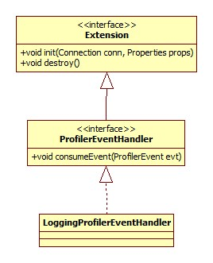

getMultiHostSafeProxy方法用于在负载均衡的情况下获得代理对象，如果使用了负载均衡，那么必定有多台真实的Mysql物理机，所以在这种情况下连接就变成一个逻辑上的概念。

下面看一下ProfilerEventHandlerFactory.getInstance的实现:

```java
public static synchronized ProfilerEventHandler getInstance(MySQLConnection conn) throws SQLException {
    //这里获取的就是ConnectionImpl内部的eventSink，第一次当然为null
    ProfilerEventHandler handler = conn.getProfilerEventHandlerInstance();
    if (handler == null) {
        handler = (ProfilerEventHandler) Util.getInstance(conn.getProfilerEventHandler(),
            new Class[0], new Object[0], conn.getExceptionInterceptor());
        conn.initializeExtension(handler);
        conn.setProfilerEventHandlerInstance(handler);
    }
    return handler;
}
```

Util.getInstance方法根据传入的完整类名用反射的方式初始化一个对象并返回，完整类名便是conn.getProfilerEventHandler()方法获得的在ConnectionPropertiesImpl中定义的profilerEventHandler参数，默认值便是com.mysql.jdbc.profiler.LoggingProfilerEventHandler，不过从这里我们也可以看出，Mysql为我们留下了扩展的机会。

LoggingProfilerEventHandler的实现非常简单:

```java
public class LoggingProfilerEventHandler implements ProfilerEventHandler {
    private Log log;
    public void consumeEvent(ProfilerEvent evt) {
        if (evt.eventType == ProfilerEvent.TYPE_WARN) {
            this.log.logWarn(evt);
        } else {
            this.log.logInfo(evt);
        }
    }
    public void destroy() {
        this.log = null;
    }
    //被上面的initializeExtension方法调用
    public void init(Connection conn, Properties props) throws SQLException {
        this.log = conn.getLog();
    }
}
```

## ProfilerEvent

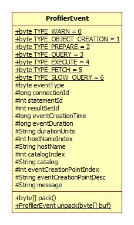

推测: 此类必定是检测事件对象的序列化与反序列化的载体。

# 预编译缓存

所谓的"预编译"指的便是jdbc标准里面的PreparedStatement：

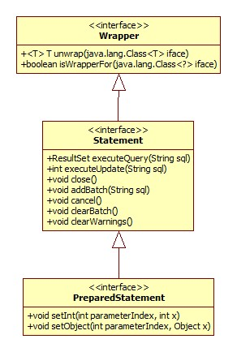

注意，Statement和PreparedStatement的类图并未画全，否则实在是太长了。:cry:

Statement在jdbc里代表的便是一条sql语句的执行，而这里的编译指的是什么将在后面提到。参数cachePrepStmts 如果设为true，那么jdbc便会将编译之后得到的PreparedStatement对象缓存起来，**当在一个连接内**多次针对同一条sql语句调用`connection.prepareStatement(sql)`方法时返回的实际上是一个PreparedStatement对象。这在数据库连接池中非常有用，默认是关闭的。

预编译的好处共有两点:

- 减轻Mysql服务的负担，这不废话么。
- **抵御SQL注入攻击**，

如果我们开启了此参数，那么Mysql jdbc将为其建立相应的缓存数据结构，initializeDriverProperties方法相应源码:

```java
if (getCachePreparedStatements()) {
    createPreparedStatementCaches();
}
```

createPreparedStatementCaches简略版源码:

```java
private void createPreparedStatementCaches() throws SQLException {
    synchronized (getConnectionMutex()) {
        //默认25
        int cacheSize = getPreparedStatementCacheSize();
        //1.
        Class<?> factoryClass = Class.forName(getParseInfoCacheFactory());
        CacheAdapterFactory<String, ParseInfo> cacheFactory = ((CacheAdapterFactory<String, ParseInfo>) factoryClass.newInstance());
        this.cachedPreparedStatementParams = cacheFactory.getInstance(this, this.myURL, getPreparedStatementCacheSize(),
                getPreparedStatementCacheSqlLimit(), this.props);
        //2.
        if (getUseServerPreparedStmts()) {
            this.serverSideStatementCheckCache = new LRUCache(cacheSize);
            this.serverSideStatementCache = new LRUCache(cacheSize) {
                private static final long serialVersionUID = 7692318650375988114L;
                @Override
                protected boolean removeEldestEntry(java.util.Map.Entry<Object, Object> eldest) {
                    if (this.maxElements <= 1) {
                        return false;
                    }
                    boolean removeIt = super.removeEldestEntry(eldest);
                    if (removeIt) {
                        ServerPreparedStatement ps = (ServerPreparedStatement) eldest.getValue();
                        ps.isCached = false;
                        ps.setClosed(false);

                        try {
                            ps.close();
                        } catch (SQLException sqlEx) {
                            // punt
                        }
                    }
                    return removeIt;
                }
            };
        }
    }
}
```

整个方法的逻辑明显可以分为2部分，第一部分的效果就是创建了一个cachedPreparedStatementParams并保存在ConnectionImpl内部，定义如下:

```java
/** A cache of SQL to parsed prepared statement parameters. */
private CacheAdapter<String, ParseInfo> cachedPreparedStatementParams;
```

factoryClass默认为PerConnectionLRUFactory:

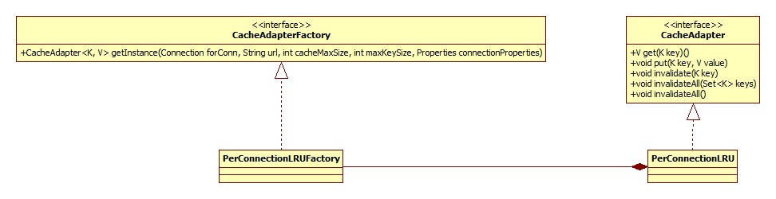

为什么缓存接口名为CacheAdapter呢?

Mysql允许我们使用不同的CacheAdapterFactory实现，可以通过参数parseInfoCacheFactory传入，加入我们想用Guava cache代替默认的缓存实现，那么我们只需要编写一个类并实现CacheAdapter接口，内部委托给Guava cache，这不就相当于一个Adapter吗，猜的好有道理的样子，逃:)...

PerConnectionLRU内部完全委托给LRUCache实现:

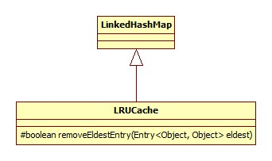

# 服务端编译

默认Mysql的jdbc编译是在客户端完成的，我们可以通过参数useServerPrepStmts 将其改为在服务器端编译，不过Mysql官方建议应该非常谨慎(不要)修改这个参数，这两部分内容可以参考:

[What's the difference between cachePrepStmts and useServerPrepStmts in MySQL JDBC Driver](https://stackoverflow.com/questions/32286518/whats-the-difference-between-cacheprepstmts-and-useserverprepstmts-in-mysql-jdb)

# 存储过程缓存

jdbc标准里CallableStatement负责对存储过程的调用执行，而cacheCallableStmts参数正是用于开启对存储过程调用的缓存，initializeDriverProperties方法相关源码:

```java
if (getCacheCallableStatements()) {
    this.parsedCallableStatementCache = new LRUCache(getCallableStatementCacheSize());
}
```

# 元数据缓存

众所周知我们在进行select操作时，jdbc将返回ResultSet对象作为结果集，调用其getMetaData方法可以获得一个ResultSetMetaData对象，这就代表了结果集的元数据信息:

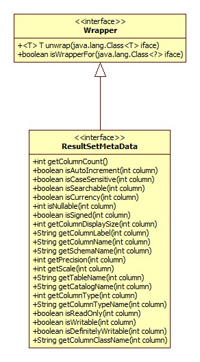

从中我们可以获得列数，列的相关信息等。initializeDriverProperties方法相关源码:

```java
if (getCacheResultSetMetadata()) {
    this.resultSetMetadataCache = new LRUCache(getMetadataCacheSize());
}
```

关于此属性可进一步参考:

[What metadata is cached when using cacheResultSetMetadata=true with MySQL JDBC connector?](https://stackoverflow.com/questions/23817312/what-metadata-is-cached-when-using-cacheresultsetmetadata-true-with-mysql-jdbc-c)

# 批量查询

如果我们开启了allowMultiQueries参数，那么便可以这样写SQL语句交给Mysql执行:

```sql
select * from student;select name from student;
```

一次写多条，中间以分号分割。

不过在目前的Mysql驱动实现中，此选项和元数据缓存是冲突的，即如果开启了此选项，元数据缓存将会被禁用，即使cacheResultSetMetadata设为true:

```java
if (getAllowMultiQueries()) {
    setCacheResultSetMetadata(false); // we don't handle this yet
}
```

# StatementInterceptor

Mysql驱动允许我们通过参数statementInterceptors指定一组StatementInterceptor:

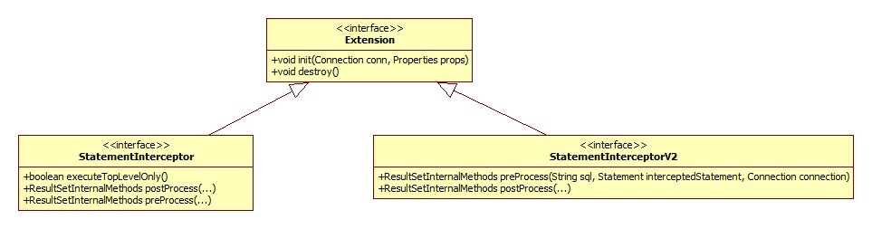

就像Netty、Tomcat一样，这里又是链式调用的实现，preProcess和postProcess方法会在每个语句执行的前后分别被调用。 initializeSafeStatementInterceptors方法会检测并初始化我们指定的拦截器:

```java
public void initializeSafeStatementInterceptors() throws SQLException {
    this.isClosed = false;
    //反射初始化
    List<Extension> unwrappedInterceptors = Util.loadExtensions(this, this.props, getStatementInterceptors(), , );
    this.statementInterceptors = new ArrayList<StatementInterceptorV2>(unwrappedInterceptors.size());
    for (int i = 0; i < unwrappedInterceptors.size(); i++) {
        Extension interceptor = unwrappedInterceptors.get(i);
        if (interceptor instanceof StatementInterceptor) {
            if (ReflectiveStatementInterceptorAdapter.getV2PostProcessMethod(interceptor.getClass()) != null) {
                this.statementInterceptors.add(
                    new NoSubInterceptorWrapper(new ReflectiveStatementInterceptorAdapter((StatementInterceptor) interceptor)));
            } else {
                this.statementInterceptors.add(
                    new NoSubInterceptorWrapper(new V1toV2StatementInterceptorAdapter((StatementInterceptor) interceptor)));
            }
        } else {
            this.statementInterceptors.add(new NoSubInterceptorWrapper((StatementInterceptorV2) interceptor));
        }
    }
}
```

从源码中可以看出两点:

- StatementInterceptorV2接口应该是StatementInterceptor的新(替代)版本，源码中使用Adapter将老版本适配为新版本。

- NoSubInterceptorWrapper相当于一个装饰器，我们来看一下其preProcess方法的实现便知其目的:

  ```java
  public ResultSetInternalMethods preProcess(String sql, Statement interceptedStatement, Connection connection) {
    this.underlyingInterceptor.preProcess(sql, interceptedStatement, connection);
    return null; // don't allow result set substitution
  }
  ```

  underlyingInterceptor为被装饰者，根据StatementInterceptor(V2)语义，如果preProcess或postProcess方法的返回值非空，那么驱动便会将此值作为结果集返回给调用者，而不是真正的数据库查询结果。所以包装为NoSubInterceptorWrapper的目的便是**在驱动启动(初始化)时禁用这一特性**。

# 连接

ConnectionImpl.createNewIO:

```java
public void createNewIO(boolean isForReconnect) throws SQLException {
    synchronized (getConnectionMutex()) {
        Properties mergedProps = exposeAsProperties(this.props);
        if (!getHighAvailability()) {
            connectOneTryOnly(isForReconnect, mergedProps);
            return;
        }
        connectWithRetries(isForReconnect, mergedProps);
    }
}
```

源码说的"HighAvailability"是啥？

```java
protected boolean getHighAvailability() {
    return this.highAvailabilityAsBoolean;
}
```

highAvailabilityAsBoolean在ConnectionPropertiesImpl.postInitialization方法中被设置:

```java
this.highAvailabilityAsBoolean = this.autoReconnect.getValueAsBoolean();
```

其实就是一个自动重连而已，默认为false。:joy_cat:

connectOneTryOnly简略版源码:

```java
private void connectOneTryOnly(boolean isForReconnect, Properties mergedProps){
    coreConnect(mergedProps);
    this.connectionId = this.io.getThreadId();
    this.isClosed = false;
    this.io.setStatementInterceptors(this.statementInterceptors);
    // Server properties might be different from previous connection, so initialize again...
    initializePropsFromServer();
    return;
}
```

coreConnect方法简略版源码:

```java
private void coreConnect(Properties mergedProps) {
    this.io = new MysqlIO(newHost, newPort, mergedProps, getSocketFactoryClassName(), getProxy(), getSocketTimeout(),
        this.largeRowSizeThreshold.getValueAsInt());
    this.io.doHandshake(this.user, this.password, this.database);
    if (versionMeetsMinimum(5, 5, 0)) {
        // error messages are returned according to character_set_results which, at this point, is set from the response packet
        this.errorMessageEncoding = this.io.getEncodingForHandshake();
    }
}
```

MysqlIO类用于驱动与服务器的交互，其构造器源码精简如下:

```java
public MysqlIO(String host, int port, Properties props, String socketFactoryClassName, MySQLConnection conn, int socketTimeout,
            int useBufferRowSizeThreshold) {
    this.socketFactory = createSocketFactory();
    this.mysqlConnection = this.socketFactory.connect(this.host, this.port, props);
    if (socketTimeout != 0) {
        try {
            this.mysqlConnection.setSoTimeout(socketTimeout);
        } catch (Exception ex) {
            /* Ignore if the platform does not support it */
        }
    }
    //意义不大，跳过
    this.mysqlConnection = this.socketFactory.beforeHandshake();
    //input
    if (this.connection.getUseReadAheadInput()) {
        this.mysqlInput = new ReadAheadInputStream(this.mysqlConnection.getInputStream(), 16384, this.connection.getTraceProtocol(),
                this.connection.getLog());
    } else if (this.connection.useUnbufferedInput()) {
        this.mysqlInput = this.mysqlConnection.getInputStream();
    } else {
        this.mysqlInput = new BufferedInputStream(this.mysqlConnection.getInputStream(), 16384);
    }
    this.mysqlOutput = new BufferedOutputStream(this.mysqlConnection.getOutputStream(), 16384);
}
```

## SocketFactory

驱动使用SocketFactory接口完成Socket的创建与连接，这里仍然是策略模式的体现，默认实现是com.mysql.jdbc.StandardSocketFactory.

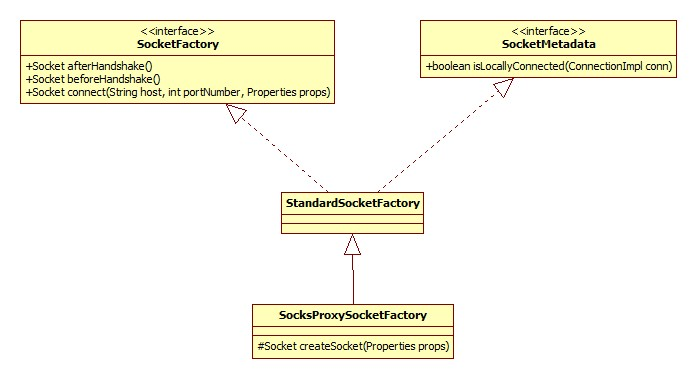

StandardSocketFactory的connect方法实现其实就是创建Socket并连接到给定的地址，但是有一个细节值得注意:

```java
InetAddress[] possibleAddresses = InetAddress.getAllByName(this.host);
for (int i = 0; i < possibleAddresses.length; i++) {
    this.rawSocket = createSocket(props);
    configureSocket(this.rawSocket, props);
    InetSocketAddress sockAddr = new InetSocketAddress(possibleAddresses[i], this.port);
    this.rawSocket.connect(sockAddr, getRealTimeout(connectTimeout));
    break;
}
```

InetAddress.getAllByName方法将会返回给定的hostname的所有的IP地址，比如如果hostname是localhost，那么返回的结果是:

[localhost/127.0.0.1, localhost/0:0:0:0:0:0:0:1]

一个是IPV4地址，另一个是IPV6地址。如果hostname为www.baidu.com:

[www.baidu.com/119.75.213.61, www.baidu.com/119.75.216.20]

原理其实就是DNS查找，Mysql驱动将会遍历IP数组，只要有一个IP连接成功即结束遍历。

## 输入流

MysqlIO构造器源码input标记处决定了驱动使用何种输入流。有三种选项:

- Mysql的ReadAheadInputStream，useReadAheadInput参数控制，默认true.
- jdk BufferedInputStream.
- 最原始的输入流，即SocketInputsream.

在这里重点关注ReadAheadInputStream和BufferedInputStream的区别以及它的好处到底在哪里。类图:

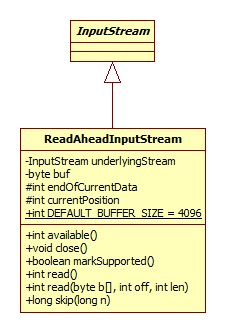

通过对两个类源码的详细阅读以及对比，得出结论: **ReadAheadInputStream就是去掉了mark(), reset()方法支持的BufferedInputStream**,其它的核心逻辑的实现完全一样，markSupported方法源码:

```java
@Override
public boolean markSupported() {
    return false;
}
```

## 输出流

就是原生BufferedOutputStream，没什么好说的。

## 握手

握手所做的可以概括为以下两个方面:

- 接收Mysql服务器发送而来的版本等信息，客户端(jdbc)根据这些信息判断驱动和服务器的版本是否可以相互支持，以及决定哪些特性可以使用。
- 向服务器发送用户名密码等认证信息完成登录。

相应的源码实现需要根据各个版本信息进行复杂的条件判断，这里不再贴出。整个交互的流程可如下图进行表示:

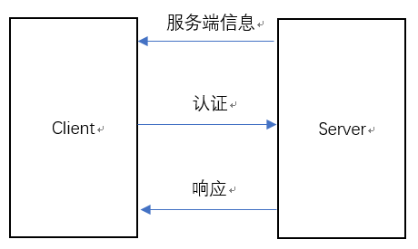

Mysql底层在进行消息的发送与接收时，使用的是类似于TLV的结构，不过这里没有T，只有L和V，以服务端信息阶段为例，服务器发送过来的消息的格式大体如下:

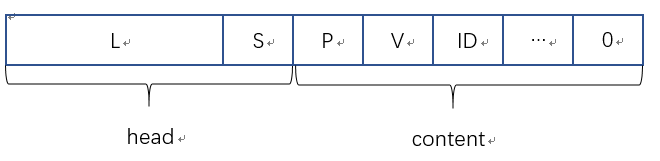

head(消息头)由4个字节组成，前三个字节为长度字段，小端序，假设其采用的是无符号数(没有理由使用有符号数)，那么可以表示的最大消息体长度为16MB，其实在驱动内部将消息体的最大长度限制在1MB，如果超过此值那么将会抛出异常。S表示一字节的包序列号。

消息内容以一个人为追加的空字符(0)作为结尾，事实上在驱动内部读取字符串类型时均以遇到字节0作为此次读取的结束。P表示消息版本号，V表示服务器的版本，字符串类型，示例: "5.5.6"；ID表示此次连接的ID。

### 认证: 可插拔

这里的认证指的便是客户端(驱动)向服务器发送用户名、密码完成登录的过程，Mysql自5.5.7版本(这里使用的是5.7.18)开始引入了可插拔登录的概念，主要目的有两点:

- 引入扩展登录方式支持，比如利用Windows ID、Kerberos进行认证。传统的认证方式是**查询Mysql的mysql.user表**。
- 支持"代理"用户。

具体可以参考Mysql官方文档: [6.3.6 Pluggable Authentication](https://dev.mysql.com/doc/refman/5.5/en/pluggable-authentication.html)

反映到代码层次上就是驱动将密码的转换抽象为插件的形式，密码的转换以默认的插件进行说明: 假定我们的密码为"1234"，Mysql中实际存储的必定不是简单的字符串1234，而是经过摘要/加密得到的串，那么这个过程便称为"转换"。"插件"的类图如下:

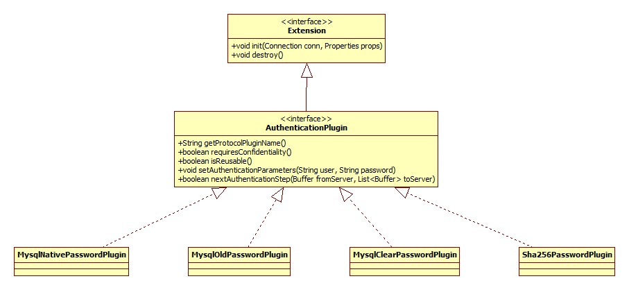

AuthenticationPlugin的每一个实现类都是Mysql**内建支持**的认证插件，我们可以通过参数defaultAuthenticationPlugin指定使用的插件，默认为MysqlNativePasswordPlugin，关于此插件的说明可以参考官方文档:

[6.5.1.1 Native Pluggable Authentication](https://dev.mysql.com/doc/refman/5.5/en/native-pluggable-authentication.html)

其对明文密码进行处理的核心逻辑位于方法nextAuthenticationStep:

```java
bresp = new Buffer(Security.scramble411(pwd, fromServer.readString(), this.connection.getPasswordCharacterEncoding()));
```

驱动中加载插件、利用插件进行认证的入口位于MysqlIO的proceedHandshakeWithPluggableAuthentication方法。

从上面的内容也可以看出，Mysql进行认证时通过网络进行传输的并不是明文，如果是，那就丢人了。