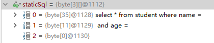
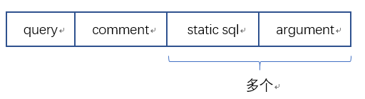
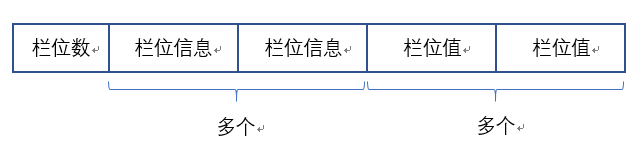

以下列源码为例进行说明:

```java
@Test
public void query() throws SQLException {
    final String sql = "select * from student";
    PreparedStatement ps = connection.prepareStatement(sql);
    ResultSet rs = ps.executeQuery();
    while (rs.next()) {
        System.out.println("User: " + rs.getString("name") + ".");
    }
}
```

prepareStatement方法的实现位于ConnectionImpl:

```java
public java.sql.PreparedStatement prepareStatement(String sql) throws SQLException {
    return prepareStatement(sql, DEFAULT_RESULT_SET_TYPE, DEFAULT_RESULT_SET_CONCURRENCY);
}
```

DEFAULT_RESULT_SET_TYPE的定义如下:

```java
private static final int DEFAULT_RESULT_SET_TYPE = ResultSet.TYPE_FORWARD_ONLY;
```

含义为通过此种类型结果集得到的cursor只能单向向后进行遍历。

DEFAULT_RESULT_SET_CONCURRENCY定义:

```java
private static final int DEFAULT_RESULT_SET_CONCURRENCY = ResultSet.CONCUR_READ_ONLY;
```

prepareStatement方法的源码实现较长，这里分部分进行说明。

# 线程安全

prepareStatement方法所有的逻辑均在锁的保护下执行:

```java
synchronized (getConnectionMutex()) {
    //...
}
```

getConnectionMutex方法获得的其实就是连接对象本身，为什么要加锁呢，因为一个连接对象完全有可能在多个线程中被使用。

# PrepareStatement创建

我们以客户端编译同时开启PrepareStatement缓存为例，ConnectionImpl.clientPrepareStatement方法相关源码:

```java
if (getCachePreparedStatements()) {
    PreparedStatement.ParseInfo pStmtInfo = this.cachedPreparedStatementParams.get(nativeSql);
    if (pStmtInfo == null) {
        //反射创建PreparedStatement对象
        pStmt = com.mysql.jdbc.PreparedStatement.getInstance(getMultiHostSafeProxy(), nativeSql, this.database);
        this.cachedPreparedStatementParams.put(nativeSql, pStmt.getParseInfo());
    } else {
        pStmt = new com.mysql.jdbc.PreparedStatement(getMultiHostSafeProxy(), nativeSql, this.database, pStmtInfo);
    }
}
```

核心的缓存数据结构cachedPreparedStatementParams其实就是一个继承自LinkedHashMap实现的LRU缓存，可以看出，缓存的并不是PreparedStatement，而是ParseInfo对象，缓存的key就是我们的SQL语句。

ParseInfo代表着一条SQL语句在客户端"编译"的结果，对于SQL的编译的入口位于PreparedStatement的构造器：

```java
this.parseInfo = new ParseInfo(sql, this.connection, this.dbmd, this.charEncoding, this.charConverter);
```

ParseInfo类在其构造器中完成对SQL的编译，其本身就是PreparedStatement的嵌套类，那么这里的编译指的是什么呢?我们将测试用的SQL语句稍作改造:

```java
final String sql = "select * from student where name = ? and age = ?";
PreparedStatement ps = connection.prepareStatement(sql);
ps.setString(1, "skywalker");
ps.setInt(2, 22);
```

ParseInfo内部有一个关键的属性:

```java
byte[][] staticSql = null
```

通过调试可以发现，解析之后此属性的值变成了:



可以推测: 在对PreparedStatement进行参数设置时，必定是在数组的各个元素之间插入，至于为什么要使用byte数组而不是String数组，猜测是为了便于后续利用网络进行传输。

所以这里可以得出结论: 对PreparedStatement的编译其实就是**将SQL语句按照占位符进行分割**，对ParseInfo进行缓存而不是PreparedStatement的原因便是**PreparedStatement必定要保存具体的参数值**。

# 参数设置

我们以方法:

```java
ps.setString(1, "skywalker");
```

为例，具体实现位于com.mysql.jdbc.PreparedStatement中。

## 字符串包装

对于字符串类型，驱动会对其用单引号包装，相应源码:

```java
if (needsQuoted) {
    parameterAsBytes = StringUtils.getBytesWrapped(parameterAsString, '\'', '\'', this.charConverter, this.charEncoding,
            this.connection.getServerCharset(), this.connection.parserKnowsUnicode(), getExceptionInterceptor());
}
```

## 设置

PreparedStatement.setInternal方法:

```java
protected final void setInternal(int paramIndex, byte[] val) {
    synchronized (checkClosed().getConnectionMutex()) {
        int parameterIndexOffset = getParameterIndexOffset();
        checkBounds(paramIndex, parameterIndexOffset);
        this.isStream[paramIndex - 1 + parameterIndexOffset] = false;
        this.isNull[paramIndex - 1 + parameterIndexOffset] = false;
        this.parameterStreams[paramIndex - 1 + parameterIndexOffset] = null;
        this.parameterValues[paramIndex - 1 + parameterIndexOffset] = val;
    }
}
```

从中我们可以看出几点:

1. PreparedStatement的setXXX方法的序号是从1开始的。
2. PreparedStatement允许我们以输入流/Reader的形式作为值传入。
3. parameterValues是一个byte二维数组。

## 参数类型保存

PreparedStatement.setString相关源码:

```java
this.parameterTypes[parameterIndex - 1 + getParameterIndexOffset()] = Types.VARCHAR;
```

parameterTypes是一个int数组，依次保存了所有参数的类型。

# 查询

入口位于com.mysql.jdbc.PreparedStatement的executeQuery方法，依然是在加锁的情况下执行的。

## 流式查询

```java
boolean doStreaming = createStreamingResultSet();
```

驱动支持流式的从数据库服务获得查询结果而不是一次性全部将结果取回，但默认是没有开启的:

```java
protected boolean createStreamingResultSet() {
    synchronized (checkClosed().getConnectionMutex()) {
        return ((this.resultSetType == java.sql.ResultSet.TYPE_FORWARD_ONLY) && 
        (this.resultSetConcurrency == java.sql.ResultSet.CONCUR_READ_ONLY) && (this.fetchSize == Integer.MIN_VALUE));
    }
}
```

TYPE_FORWARD_ONLY指结果集只能单向向后移动，CONCUR_READ_ONLY指结果集只读，不满足的是最后一个条件，默认情况下fetchSize为0，我们可以通过将参数defaultFetchSize设为int最小值以支持这一特性。

## 查询Packet创建

fillSendPacket方法:

```java
protected Buffer fillSendPacket() throws SQLException {
    synchronized (checkClosed().getConnectionMutex()) {
        return fillSendPacket(this.parameterValues, this.parameterStreams, this.isStream, this.streamLengths);
    }
}
```

所谓的Packet其实就是向数据库服务发送的一个byte数组，所以这里我们重点关注一下驱动是如何组织消息格式的。

### 缓冲区

Packet的载体获取方式如下:

```java
Buffer sendPacket = this.connection.getIO().getSharedSendPacket();
```

Buffer是驱动自己实现的、基于byte数组的一个简单缓冲区，可以看出，**一个连接的所有查询操作(也可能含其它操作)公用一个缓冲区**，线程安全性由连接唯一的锁保证。

### 格式

对于查询来说，格式如下:



query是一个单字节的指示位，定义如下:

```java
static final int QUERY = 3;
```

驱动允许我们为连接的所有statement指定一个通用/全局的注释，我们可以通过com.mysql.jdbc.Connection的setStatementComment方法进行设置，注意我们设置的应该仅仅包含注释，驱动会自动为我们用`/*`和`*/`(共6个字符，包括两个空格)包围。

static sql和argument便印证了之前对预编译和参数设置行为的猜测。这部分源码如下:

```java
for (int i = 0; i < batchedParameterStrings.length; i++) {
    sendPacket.writeBytesNoNull(this.staticSqlStrings[i]);
    if (batchedIsStream[i]) {
        streamToBytes(sendPacket, batchedParameterStreams[i], true, batchedStreamLengths[i], useStreamLengths);
    } else {
        sendPacket.writeBytesNoNull(batchedParameterStrings[i]);
    }
}
sendPacket.writeBytesNoNull(this.staticSqlStrings[batchedParameterStrings.length]);
```

batchedParameterStrings便是parameterValues二维数组。

注意，这里有一个细节:

**驱动并未将参数的类型信息发送给数据库服务**,这一点可以从parameterTypes的定义上可以得到印证:

```java
 /**
  * Only used by statement interceptors at the moment to
  * provide introspection of bound values
  */
protected int[] parameterTypes = null;
```

那么数据库服务如何得知类型信息呢?猜测:

服务端会对SQL进行语法分析，必然可以结合表定义得到每个字段的类型信息，然后Mysql会对参数byte数组进行转换，转换失败也就报错了。

## 交互

与数据库服务交互的核心逻辑位于MysqlIO的sqlQueryDirect方法，简略版源码:

```java
final ResultSetInternalMethods sqlQueryDirect(StatementImpl callingStatement, String query, 
    String characterEncoding, Buffer queryPacket, int maxRows,
    int resultSetType, int resultSetConcurrency, boolean streamResults, String catalog, Field[] cachedMetadata) {
    
    //前置拦截方法调用
    if (this.statementInterceptors != null) {
        ResultSetInternalMethods interceptedResults = invokeStatementInterceptorsPre(query, callingStatement, false);
        //拦截器返回结果不为null，不进行实际的查询
        if (interceptedResults != null) {
            return interceptedResults;
        }
    }
    Buffer resultPacket = sendCommand(MysqlDefs.QUERY, null, queryPacket, false, null, 0);
    ResultSetInternalMethods rs = readAllResults(callingStatement, maxRows, resultSetType, resultSetConcurrency, 
        streamResults, catalog, resultPacket, false, -1L, cachedMetadata);
  
    //拦截器后置方法调用
    if (this.statementInterceptors != null) {
        ResultSetInternalMethods interceptedResults = invokeStatementInterceptorsPost(query, callingStatement, rs, false, null);
        if (interceptedResults != null) {
            rs = interceptedResults;
        }
    }
    return rs;
}
```

### 结果集读取

核心逻辑位于MysqlIO的readResultsForQueryOrUpdate方法，简略版源码:

```java
protected final ResultSetImpl readResultsForQueryOrUpdate(StatementImpl callingStatement, 
        int maxRows, int resultSetType, int resultSetConcurrency,
        boolean streamResults, String catalog, Buffer resultPacket, boolean isBinaryEncoded, 
        long preSentColumnCount, Field[] metadataFromCache) {
    //栏位数
    long columnCount = resultPacket.readFieldLength();
    if (columnCount == 0) {
        return buildResultSetWithUpdates(callingStatement, resultPacket);
    } else if (columnCount == Buffer.NULL_LENGTH) {
        //...
    } else {
        com.mysql.jdbc.ResultSetImpl results = getResultSet(callingStatement, columnCount, 
            maxRows, resultSetType, resultSetConcurrency, streamResults, catalog, isBinaryEncoded, metadataFromCache);
        return results;
    }
}
```

#### 栏位数/字段长度

readFieldLength方法用于读取返回一个字段的长度:

```java
final long readFieldLength() {
    int sw = this.byteBuffer[this.position++] & 0xff;
    switch (sw) {
        case 251:
            return NULL_LENGTH;
        case 252:
            return readInt();
        case 253:
            return readLongInt();
        case 254:
            return readLongLong();
        default:
            return sw;
    }
}
```

这里使用了一个小小的优化策略: 采用不定长的字节数存储，当数值较小时，一个字节就够了，这样可以降低网络带宽的占用。对于我们测试用的student表，有id、name和age三个字段，所以返回3.

#### 格式

包含栏位数，最终返回的byte数组的格式大致如下:



**栏位值的个数应该是栏位信息数的整数倍**，两者的比值应该就是结果集的行数，这里只是猜测，没有经过源码上的验证。

其中栏位信息又包括多个字段(栏位的描述信息，个数是是固定的)，每个字段的格式如下:


主要字段及其意义如下:

1. catalogName
2. databaseName
3. tableName
4. name
5. colLength
6. colType
7. colFlag
8. colDecimals

分别表示数据库名、表明、字段名，字段类型等信息。

# 超时

这部分是受《亿级流量》一书的启发，即：**MySQL会为每一个连接创建一个Timer线程用于SQL执行超时控制**。下面来从源码的角度进行证实。

关键点位于PreparedStatement的executeInternal方法，相关源码如下:

```java
protected ResultSetInternalMethods executeInternal(...) {
    if (locallyScopedConnection.getEnableQueryTimeouts() 
        && this.timeoutInMillis != 0 
        && locallyScopedConnection.versionMeetsMinimum(5, 0, 0)
    ) {
		timeoutTask = new CancelTask(this);
        locallyScopedConnection
            .getCancelTimer().schedule(timeoutTask, this.timeoutInMillis);
    }
}
```

可以看出，启用超时检测的前提条件是我们开启了查询超时机制并且超时时间不为零。查询超时机制是默认启用的，超时时间需要我们手动去设置。

locallyScopedConnection其实就是当前的数据库连接，下面看一下getCancelTimer方法实现:

```java
public Timer getCancelTimer() {
    synchronized (getConnectionMutex()) {
        if (this.cancelTimer == null) {
            this.cancelTimer = new Timer(true);
        }
        return this.cancelTimer;
    }
}
```

从这里可以看出，如果我们的数据库连接池设置的最大连接数过大，在极限的情况下，连接池将会至少占用

连接数 * 1MB的内存，记住这一点。

## 两种超时

还有一个有意思的问题，MySQL的queryTimeout和socketTimeout究竟有什么区别？

参考这篇美团的文章：

[深入分析JDBC超时机制](https://blog.csdn.net/a837199685/article/details/75796891)

简而言之，最好这两个超时都设置一下，**并且queryTimeout应比socketTimeout要小**。


